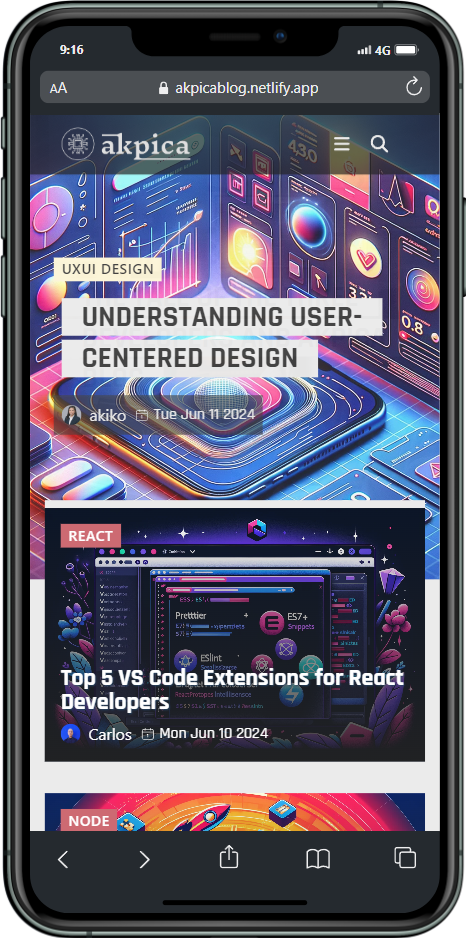

# AkPiCa - Blog

**[⏩ Link to our Page]()**
---

**The Web Developer's Handbook:**
Your ultimate guide to mastering web development.

Explore the latest trends, tools, and techniques in web design and development. From beginner tutorials to advanced tips, discover how to create stunning, responsive websites and applications. Join our community of developers and stay ahead in the ever-evolving world of web development.

# The AkPiCa Team

<table>
  <tbody>
    <tr>
      <td align="center" valign="top">
         
        
<strong>Ak</strong>iko Luka

        :white_check_mark:
      </td>
      <td align="center" valign="top">
         
        
<strong>Pi</strong>la Gonzalez

        :white_check_mark:
      </td>
      <td align="center" valign="top">
         
        
<strong>Ca</strong>rlos Sousa

        :white_check_mark:
      </td>
    </tr>
  </tbody>
</table>

## Tools
### Frontend
1. Vite
2. React
3. React Router
4. TinyMCE
5. React Icons
6. Netlify
7. Axios
8. Disqus-React
9.  Dompurify
10. IPInfo.io
11. Leonardo.ai

### Backend
1. Express
2. Express-Validator
3. Mongoose
4. Render
5. Bcrypt
6. Colors
7. Cookie-Parser
8. Cors
9. Dotenv
10. Jsonwebtoken
11. Morgan
12. Multer
13. Slugify

## Feature

---

## Getting Started

# Contributing to AKPICA - blog.
We love your input! We want to make contributing to this project as easy and transparent as possible, whether it's:

- Reporting a bug
- Discussing the current state of the code
- Submitting a fix
- Proposing new features
- Becoming a maintainer

## We Develop with Github
We use github to host code, to track issues and feature requests, as well as accept pull requests.

## All Code Changes Happen Through Pull Requests
Pull requests are the best way to propose changes to the codebase. We actively welcome your pull requests:

1. First `Fork` this Repo to your Github account 
2. `Clone` the forked repo to your local machine
3. Create a new `branch` on your local machine
4. Make your changes and `commit` them to your local repo
5. `Push` your changes to your forked repo
6. Submit a `Pull Request` so that we can review your changes
7. Add a description to your `Pull Request` that explains your changes
8. If everything is ok, we will `merge` your `Pull Request` to the `main` branch

## Any contributions you make will be under the MIT Software License
In short, when you submit code changes, your submissions are understood to be under the same [MIT License](http://choosealicense.com/licenses/mit/) that covers the project. Feel free to contact the maintainers if that's a concern.