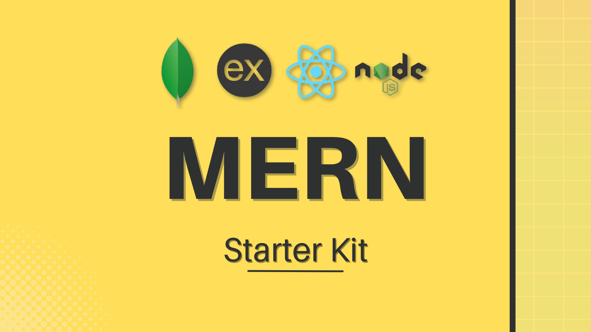

### This template provides a minimal MERN setup. It's configured to use `pnpm` as the package manager.

## Setup Node.js, npm, pnpm and degit

-   Install **_Node_** and **_npm_**

    -   Download the latest version of Node.js and npm from [here](https://nodejs.org/en).
    -   Install Node.js and npm by following the installation wizard.

-   Install **_pnpm_** globally by running the following command in your terminal:

```bash
npm install -g pnpm
```

-   Install **_degit_** globally by running the following command in your terminal:

```bash
npm install -g degit
```

## Initialize the MERN Starter Kit

### Option 1: Clone the Repository and Remove Git History

1. **Clone the Repository:**

    ```bash
    git clone https://github.com/Pilag6/MERN.git
    ```

2. **Navigate to the Project Directory:**

    ```bash
    cd MERN
    ```

3. **Remove Existing Git History:**

    ```bash
    rm -rf .git
    ```

    This command will remove the existing Git history. That way, you can start fresh with your own Git repository.

4. **Initialize a New Git Repository:**

    ```bash
    git init
    ```

    This command initializes a new Git repository for your project.

5. **Install Dependencies using pnpm:**

    ```bash
    cd client
    pnpm install

    cd ../server
    pnpm install
    ```

    This command installs project dependencies using pnpm. If you don't have pnpm installed, you can install it globally using `npm install -g pnpm`.

6. **Run the Development Server and Client :**

    ```bash
    cd client
    pnpm run dev

    cd ../server
    pnpm run dev
    ```

    This command will start the development server in the port `http://localhost:3300`, and you can access your React application at `http://localhost:5173`.

### Option 2: Use degit

Alternatively, you can use `degit` to scaffold the template without cloning the entire repository.

1. **Use degit to Fetch the Template:**

    ```bash
    npx degit Pilag6/MERN my-MERN-app
    ```

    This command fetches the template without Git history and renames the project to `my-MERN-app`. You can replace `my-MERN-app` with your preferred project name.

    If you don't have `degit` installed, you can install it globally using `npm install -g degit`.

2. **Navigate to the Project Directory:**

    ```bash
    cd my-MERN-app
    ```

3. **Initialize a New Git Repository:**

    ```bash
    git init
    ```

    This command initializes a new Git repository for your project.

4. **Install Dependencies using pnpm:**

    ```bash
    cd client
    pnpm install

    cd ../server
    pnpm install
    ```

    This command installs project dependencies using pnpm. If you don't have pnpm installed, you can install it globally using `npm install -g pnpm`.

5. **Run the Development Server:**

    ```bash
    cd client
    pnpm run dev

    cd ../server
    pnpm run dev
    ```

    This command will start the development server in the port `http://localhost:3300`, and you can access your React application at `http://localhost:5173`.

## Folder Structure

-   We are going to follow the **MVC (Model-View-Controller)** pattern for our project structure.
-   **MVC** is a _software design pattern_ that divides the application into three interconnected components: the model, the view, and the controller.
-   This pattern helps to achieve separation of concerns.
-   **Model:** Responsible for managing the data of the application. It receives user input from the controller.
-   **View:** The user interface of the application. It displays the data using the model to the user and also enables them to modify the data.
-   **Controller:** Acts as an interface between Model and View components to process all the business logic and incoming requests, manipulate data using the Model component, and interact with the Views to render the final output.

```
client/
|-- src/
|   |-- assets/
|   |-- components/
|       |-- Login.jsx
|       |-- Register.jsx
|   |-- pages/
|   |-- App.css
|   |-- App.jsx
|   |-- index.css
|   |-- main-jsx
|-- .eslintrccjs
|-- .gitignore
|-- index.html
|-- jsconfig.json
|-- package.json
|-- vite.config.js

server/
|-- config/
|   |-- connectDB.js
|   |-- asyncHandler.js
|-- controllers/
|   |-- Controller.js
|   |-- AuthController.js
|-- middleware/
|   |-- errorHandler.js
|-- models/
|   |-- Model.js
|   |-- userModel.js
|-- routes/
|   |-- Router.js
|   |-- AuthRouter.js
|-- .env
|-- .gitignore
|-- package.json
|-- seeder.js
|-- server.js
```

## Features

-   **Client:**
    -   **React:** A JavaScript library for building user interfaces.
    -   **Vite:** A build tool that aims to provide a faster and leaner development experience for modern web projects.
    -   **React Router:** A standard routing library for React.
    -   **Axios:** A promise-based HTTP client for the browser and Node.js.
-   **Server:**
    -   **Node.js:** A JavaScript runtime built on Chrome's V8 JavaScript engine.
    -   **Express:** A minimal and flexible Node.js web application framework.
    -   **MongoDB:** A general-purpose, document-based, distributed database built for modern application developers and the cloud era.
    -   **Mongoose:** An Object Data Modeling (ODM) library for MongoDB and Node.js.
    -   **cors:** A Node.js package for providing a Connect/Express middleware that can be used to enable CORS with various options.
    -   **dotenv:** A zero-dependency module that loads environment variables from a `.env` file into `process.env`.
    -   **nodemon:** A utility that will monitor for any changes in your source and automatically restart your server.
    -   **morgan:** An HTTP request logger middleware for Node.js.
    -   **bcryptjs:** A library to help you hash passwords.
    -   **jsonwebtoken:** An implementation of JSON Web Tokens.

## Scripts

-   **Client:**

    -   `pnpm run dev`: Starts the development server.
    -   `pnpm run build`: Builds the app for production.
    -   `pnpm run lint`: Lints the code using ESLint.
    -   `pnpm run preview`: Serves the production build locally.

-   **Server:**
    -   `pnpm run dev`: Starts the development server.

## Customization

Feel free to customize the template based on your project requirements. You can add additional dependencies, components, styles, or configurations as needed. The goal is to keep the initial setup minimal, allowing you to build upon it according to your preferences.

## Environment Variables

-   Check the `.env` file in the `server` directory.

    ```env
    PORT=3300
    MONGODB_URI=your_mongodb_uri
    MONGODB_LOCAL=mongodb://localhost:27017/modelDB
    JWT_SECRET=your_jwt_secret
    ```

You can define your environment variables in this file.
Feel free to add more variables as needed and modify the existing ones with your values.

## ESLint

-   ESLint is a tool for identifying and reporting on patterns found in ECMAScript/JavaScript code.

-   The ESLint configuration file is located at `client/.eslintrc.js`.

-   You can modify the ESLint configuration based on your preferences.

## Vite Configuration

-   The Vite configuration file is located at `client/vite.config.js`.

-   You can modify the Vite configuration based on your preferences.

## Alias Configuration

You can define aliases for directories in the Vite configuration file. That way, you can import modules using the aliases instead of relative paths. Doing in this way can make your imports cleaner and more organized.

For example, you can define aliases for `@components`, `@styles`, `@utils`, etc.

Here's an example of how you can define aliases in the Vite configuration file:

```js
import { defineConfig } from "vite";
import react from "@vitejs/plugin-react";

// https://vitejs.dev/config/
export default defineConfig({
    plugins: [react()],
    resolve: {
        alias: {
            "@components": "/src/components",
            "@styles": "/src/styles",
            "@utils": "/src/utils",
            "@assets": "/src/assets",
            "@pages": "/src/pages",
            "@hooks": "/src/hooks",
            "@contexts": "/src/contexts",
            "@layouts": "/src/layouts",
            "@services": "/src/services",
            "@config": "/src/config",
            "@api": "/src/api",
            "@types": "/src/types",
            "@sections": "/src/sections",
            "@icons": "/src/icons"
        }
    }
});
```

Here is the configuration for the paths in the jsconfig.json file:

```json
{
    "compilerOptions": {
        "baseUrl": "./",
        "paths": {
            "@*": ["src/*"]
        }
    }
}
```
And then you can import modules using the aliases:

```js
import Button from "@components/Button";
import { fetchData } from "@utils/fetchData";
```

## React Router Configuration

-   The React Router configuration is located in the `client/src/App.jsx` file.

-   You can modify the React Router configuration based on your preferences.

## Express Configuration

-   The Express configuration is located in the `server/server.js` file.

-   You can modify the Express configuration based on your preferences.

## MongoDB Connection

-   The MongoDB connection is established in the `server/config/connectDB.js` file.

-   You can modify the MongoDB connection based on your preferences.

## Mongoose Models

-   The Mongoose models are defined in the `server/models` directory.

-   You can define your Mongoose models based on your project requirements.

## Routes

-   The routes are defined in the `server/routes` directory.

-   You can define your routes based on your project requirements.

## Controllers

-   The controllers are defined in the `server/controllers` directory.

-   You can define your controllers based on your project requirements.

## Middleware

-   The middleware functions are defined in the `server/middleware` directory.

-   You can define your middleware functions based on your project requirements.

## Error Handling

-   The error handling middleware is defined in the `server/middleware/errorHandler.js` file.

-   You can modify the error handling middleware based on your preferences.

## Additional Resources

-   [Vite Documentation](https://vitejs.dev/guide/)
-   [React Documentation](https://react.dev/)
-   [pnpm Documentation](https://pnpm.io/)
-   [Degit Documentation](https://www.npmjs.com/package/degit)
-   [Node.js Documentation](https://nodejs.org/en/docs/)
-   [Express Documentation](https://expressjs.com/)
-   [MongoDB Documentation](https://docs.mongodb.com/)
-   [Mongoose Documentation](https://mongoosejs.com/docs/)
-   [Axios Documentation](https://axios-http.com/docs/intro)
-   [React Router Documentation](https://reactrouter.com/en/6.22.3)
